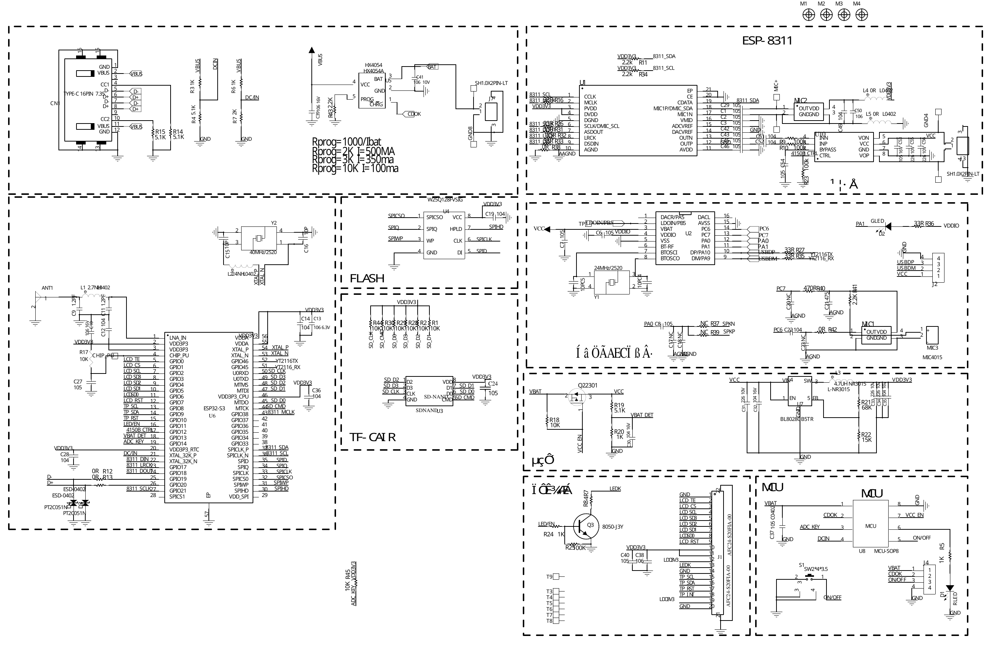

# Hardware reference: MZ46-S3-DZ V1.0

This directory documents the hardware baseline used by `esp32s3-chat-badge`. The PDF is the product schematic supplied with the source package; the PNG is a convenience preview generated from page 1.

- [Schematic PDF](MZ46-S3-DZ_V1.0.pdf)
- [Schematic preview](schematic-preview.png)

## Pin map

### Display — JD9855 QSPI, 360 × 360

| Signal | ESP32-S3 GPIO |
|---|---:|
| QSPI clock | 2 |
| Chip select | 1 |
| Data 0 | 6 |
| Data 1 | 5 |
| Data 2 | 4 |
| Data 3 | 3 |
| Reset | 7 |
| Backlight PWM | 11 |
| Tearing effect | 14 |

The firmware uses `SPI3_HOST`, 80 MHz pixel clock, RGB565, double buffering in PSRAM, and panel mirroring on both axes.

### Touch — CST816D

| Signal | ESP32-S3 GPIO |
|---|---:|
| I²C SCL | 8 |
| I²C SDA | 9 |
| Reset | 10 |
| TE/interrupt routing on PCB | 14 |

The current driver polls through the LVGL port and does not assign a dedicated interrupt GPIO in `esp_lcd_touch_config_t`.

### VB6824 audio / offline voice

| Signal | ESP32-S3 GPIO |
|---|---:|
| ESP TX → VB6824 RX | 17 |
| ESP RX ← VB6824 TX | 18 |
| Power-amplifier control | 12 |

The repository includes precompiled ESP32-S3 support libraries for ESP-IDF 5.4 and 5.5 under `components/vb6824/libs/`.

### microSD — SDMMC 4-bit

| Signal | ESP32-S3 GPIO |
|---|---:|
| CLK | 44 |
| CMD | 39 |
| D0 | 40 |
| D1 | 41 |
| D2 | 42 |
| D3 | 43 |

The card is mounted at `/sdcard`. USB Mass Storage mode temporarily unmounts the ESP VFS and exposes the card to the USB host.

### Other signals

| Function | ESP32-S3 GPIO |
|---|---:|
| BOOT / mode button | 0 |
| Battery ADC | 13 |
| Charge / USB-presence detect | 15 |
| Optional YT2216 UART TX | 46 |
| Optional YT2216 UART RX | 45 |
| Audio-control I²C SDA | 47 |
| Audio-control I²C SCL | 48 |

## Hardware assumptions

- 16 MB QIO flash is required by the provided partition layout.
- Octal PSRAM is required for the full-frame LVGL buffers and image cache.
- GPIO 15 is treated as active-high USB/charge presence by the current firmware.
- The battery calibration constants in `esp32s3_chat_badge.cc` are product-specific and should be recalibrated after battery, divider, or ADC changes.
- Alternative ES8311/JY6311 pin definitions remain in `config.h` for related PCB variants, but this board instantiates the VB6824 codec path.
